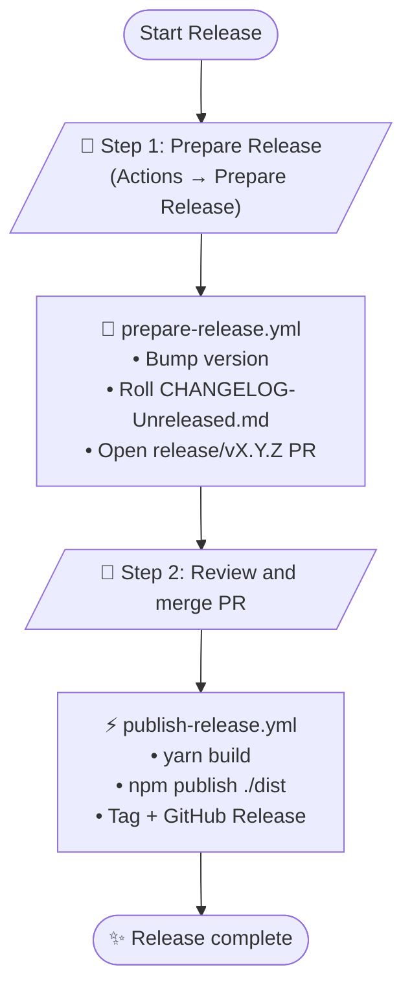

# Release Workflows

Automated releases for `nitromelondb`, modeled on the two-step process used in [react-native-google-fit](https://github.com/StasDoskalenko/react-native-google-fit).

## Workflows

### 1. `prepare-release.yml` — Prepare Release

**Trigger:** Manual (`workflow_dispatch`)

**Inputs:**

| Field | Options | Purpose |
| --- | --- | --- |
| Version bump | `none`, `patch`, `minor`, `major` | Semver bump. `none` keeps the current X.Y.Z (next `-alpha.N`, or graduate if prerelease is `none`) |
| Prerelease | `none`, `alpha`, `beta` | Optional prerelease channel |

**What it does:**

1. Calculates the next version (see [Versioning](#versioning))
2. Skips versions that already have a git tag, GitHub Release, or npm publish (alpha/beta then increment `-alpha.N`)
3. Creates or recreates a `release/vX.Y.Z` branch from master (leftover branches without a tag/release are reused; already-open PRs are not)
4. Bumps `package.json`
5. Moves `CHANGELOG-Unreleased.md` into `CHANGELOG.md` under the new version heading
6. When graduating to a stable release, folds every same-version `-alpha.N` / `-beta.N` changelog entry into that one official heading and removes the prerelease sections
7. Resets `CHANGELOG-Unreleased.md` to empty section headers
8. Syncs `docs-website/docs/docs/CHANGELOG.md`
9. Opens a PR to `master` for review

Run it from **master**: Actions → **Prepare Release** → Run workflow.

### 2. `publish-release.yml` — Publish Release

**Trigger:** Automatic when a `release/v*` PR is merged to `master`. Also manual (`workflow_dispatch` from **master`) to retry a version that is already on `master` but never made it to npm / git tag / GitHub Release.

**What it does:**

1. Builds the package (`yarn build` → `dist/`)
2. Publishes `nitromelondb` to npm (`latest`, `alpha`, or `beta` dist-tag) via OIDC trusted publishing
3. Creates git tag `vX.Y.Z`
4. Creates a GitHub Release (marked as prerelease for alpha/beta)
5. Comments on the PR with npm and GitHub links (merge trigger only)

OIDC publish follows the [npm trusted publishers GitHub Actions example](https://docs.npmjs.com/trusted-publishers#github-actions-configuration): `actions/checkout@v6`, `actions/setup-node@v6`, Node 24, `registry-url: https://registry.npmjs.org`, `package-manager-cache: false`, and `id-token: write`. We still `yarn build` and `npm publish ./dist` (this repo publishes the built tree, not the source root). Provenance is generated automatically on OIDC publishes from this public repo.

We do **not** use `on: push: tags: v*` as the primary trigger. This workflow creates the git tag with `GITHUB_TOKEN` after a release PR merge; events from `GITHUB_TOKEN` do not start a second workflow, so a tag-only job would never run. Merge + **Actions → Publish Release** (retry) is the equivalent.

## Release process



## Versioning

`package.json` is currently `0.30.0-alpha.0`. To ship another alpha of the same version, use bump **`none`** + prerelease **`alpha`**.

| Current | Bump | Prerelease | Result |
| --- | --- | --- | --- |
| `0.30.0-alpha.0` | none | alpha | `0.30.0-alpha.1` |
| `0.30.0-alpha.1` | none | beta | `0.30.0-beta.0` |
| `0.30.0-beta.0` | none | none | `0.30.0` |
| `0.30.0-alpha.0` | major | alpha | `1.0.0-alpha.0` |
| `0.28.1` | minor | alpha | `0.29.0-alpha.0` |
| `0.28.1` | patch | none | `0.28.2` |

`none` only works while a prerelease is in progress. Starting a new line still needs `patch` / `minor` / `major`. Repeating the **same** bump + channel also increments `-alpha.N` / `-beta.N`.

npm dist-tags:

- stable → `latest`
- `-alpha.N` → `alpha`
- `-beta.N` → `beta`

```bash
npm install nitromelondb@latest
npm install nitromelondb@alpha
npm install nitromelondb@beta
```

Local check:

```bash
node scripts/next-version.mjs --self-test
node scripts/next-version.mjs minor alpha
node scripts/prepare-changelog.mjs --self-test
```

## Unreleased changelog

Contributors add notes to `CHANGELOG-Unreleased.md`. Prepare Release copies non-empty sections into `CHANGELOG.md` as:

```md
## 0.29.0-alpha.0 - 2026-08-15

### New features
- ...
```

Empty section headers are dropped. The unreleased file is then reset for the next cycle.

When **prerelease is `none`** on an in-progress alpha/beta (for example `0.30.0-beta.0` → `0.30.0`), Prepare Release combines every `0.30.0-alpha.*` and `0.30.0-beta.*` section with the current unreleased notes into a single `## 0.30.0` entry. Duplicate bullets are dropped. Individual alpha/beta headings are removed from `CHANGELOG.md` (GitHub Releases for those prereleases stay as-is). A major/minor/patch that starts a **different** X.Y.Z leaves the previous line's prerelease notes alone.

## npm trusted publishing (OIDC)

Publishing does **not** use `NPM_TOKEN`. GitHub Actions authenticates to npm with a short-lived OIDC token ([trusted publishing](https://docs.npmjs.com/trusted-publishers/)).

### One-time setup on npmjs.com

`nitromelondb` must exist on npm before you can attach a trusted publisher. If it is not published yet, do **one** local bootstrap (2FA / OTP is fine here):

```bash
yarn build
npm publish ./dist --access public --otp=123456
```

Then:

1. Open [nitromelondb access settings](https://www.npmjs.com/package/nitromelondb/access)
2. Under **Trusted Publisher**, choose **GitHub Actions**
3. Fill in exactly:

   | Field | Value |
   | --- | --- |
   | Organization or user | `StasDoskalenko` |
   | Repository | `NitromelonDB` |
   | Workflow filename | `publish-release.yml` |
   | Environment name | *(leave empty)* |
   | Allowed actions | `npm publish` |

4. After the first Actions publish succeeds: Settings → **Publishing access** → **Require two-factor authentication and disallow tokens**. That blocks classic tokens; OIDC keeps working.

Do not add an `NPM_TOKEN` secret to this repository.

## Troubleshooting

### Prepare Release refused to run
- Select branch **master** when starting the workflow

### PR not created
- Check the Prepare Release run logs
- If an open `release/v…` PR already exists, merge or close it first
- A leftover `release/v…` branch with **no** git tag, GitHub Release, or npm version is recreated from master on retry
- If that version already has a tag, GitHub Release, or npm publish, Prepare Release skips it and takes the next free version (for alpha, `0.30.0-alpha.1` → `0.30.0-alpha.2`)

### npm publish did not run
- PR must come from `release/vX.Y.Z` (or `-alpha.N` / `-beta.N`) in this repository
- PR must be merged, not only closed

### npm publish failed
- Confirm the trusted publisher on npmjs.com matches `StasDoskalenko` / `NitromelonDB` / `publish-release.yml`
- Confirm the workflow has `id-token: write` (it does in `publish-release.yml`)
- Confirm that version is not already on npm
- Review the Publish Release logs
- `ENEEDAUTH` or `OIDC token exchange error - package not found` usually means the Trusted Publisher on npmjs.com is missing or does not match this workflow. Use `StasDoskalenko` / `NitromelonDB` / `publish-release.yml`, leave Environment empty, allow `npm publish`, and click **Save**.
- `ENEEDAUTH` can also mean the workflow filename or repo name does not match (case-sensitive, include `.yml`)

### Retry a failed publish (no new version)
Do **not** run Prepare Release again — that would bump to the next `-alpha.N` / `-beta.N`. After the fix is on `master`: Actions → **Publish Release** → Run workflow (branch **master**). That publishes the version already in `package.json`, then creates the git tag and GitHub Release if they are missing.
