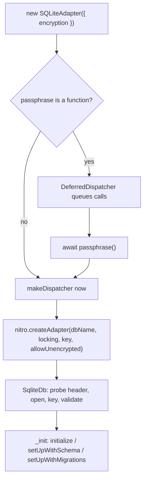

# SQLCipher-compatible database encryption

**Status:** Proposed — design only, implementation deferred.

**Related:** [#60](https://github.com/StasDoskalenko/NitromelonDB/issues/60) (Implement SQLCipher) · [#75](https://github.com/StasDoskalenko/NitromelonDB/pull/75) (SQLite 3.53.4 bump, prerequisite) · [Nozbe/WatermelonDB#1635](https://github.com/Nozbe/WatermelonDB/pull/1635) · [pinginc/watermelon-db#2](https://github.com/pinginc/watermelon-db/pull/2)

---

## Summary

Add opt-in, at-rest encryption to the SQLite adapter:

- A new `encryption` option on `SQLiteAdapter`, whose passphrase may be supplied **asynchronously** (keychain, biometric prompt, remote unlock) without forcing apps to restructure their database bootstrap.
- `database.unsafe_EncryptDB(passphrase)` and `database.unsafe_DecryptDB()` to migrate an existing database in either direction, **in place**, with writes blocked for the duration.
- `database.isDBEncrypted()` and a static pre-open probe so apps can tell which state they are in.
- Progress events, because rekeying a large database is not instant.

Databases are written in **SQLCipher v4 format**, so they remain readable by standard SQLCipher tooling.

## Why SQLite3MultipleCiphers instead of SQLCipher itself

Both linked PRs vendor Zetetic's SQLCipher amalgamation behind a build flag. That approach has four problems for this codebase:

1. **Crypto dependencies differ per platform.** SQLCipher needs an external provider: OpenSSL on Android (via the NDK prefab) and Windows, CommonCrypto on iOS. Three platforms, three configurations.
2. **The amalgamation is not distributable.** There is no downloadable SQLCipher amalgamation; it must be generated from source with `tclsh` and `./configure`. Both PRs solved this by committing a 250k-line generated blob, which cannot be refreshed by a script the way [`scripts/vendor-sqlite.mjs`](../../scripts/vendor-sqlite.mjs) refreshes SQLite today.
3. **SQLCipher cannot encrypt an existing plaintext database in place.** `PRAGMA rekey` only re-keys an already-encrypted database. Converting plaintext requires `ATTACH` + `sqlcipher_export` into a second file, then swapping and cleaning up — the temp-file dance we want to avoid.
4. **Neither PR actually migrates data.** The ping fork detects a plaintext database and *deletes it*, recreating it empty. That is a data-loss bug, not a migration.

[SQLite3MultipleCiphers](https://github.com/utelle/SQLite3MultipleCiphers) (sqlite3mc) avoids all four:

- Its `sqlcipher` cipher scheme is byte-compatible with SQLCipher v1–v4 database files.
- It bundles its own crypto. No OpenSSL, no CommonCrypto, identical build on every platform.
- It publishes an amalgamation zip per release, so `vendor-sqlite.mjs` keeps working essentially as-is.
- Its `PRAGMA rekey` handles **all three** directions — encrypt a plaintext DB, change the key, decrypt back to plaintext — in place, using a modified vacuum. No second file, no `.bak`.
- MIT licensed.

The relevant version is **sqlite3mc 2.5.0, built on SQLite 3.53.4** — the exact version [#75](https://github.com/StasDoskalenko/NitromelonDB/pull/75) vendors. Once #75 lands, this change carries a **zero SQLite version delta**: it is purely `sqlite3.c` → `sqlite3mc_amalgamation.c`. That keeps the two concerns independently bisectable, which matters because SQLite upgrades can change SQL behavior and cipher swaps can change file format.

The tradeoff accepted here: encryption support is compiled into **every** build rather than gated behind a flag. That keeps it a pure runtime opt-in with no build configuration for users, at the cost of iOS no longer linking Apple's system `libsqlite3` and a modest binary size increase.

## Public API

### Opening an encrypted database

```ts
const adapter = new SQLiteAdapter({
  schema,
  migrations,
  encryption: {
    // string, or a sync/async function resolved during adapter init
    passphrase: () => Keychain.getGenericPassword(),
  },
})
```

```ts
type Passphrase = string | (() => string | null) | (() => Promise<string | null>)

type EncryptionEvents = {
  onStart?: (info: {
    operation: 'encrypt' | 'decrypt' | 'rekey'
    pageCount: number
    byteSize: number
  }) => void
  onProgress?: (info: { elapsedMs: number; steps: number }) => void
  onSuccess?: () => void
  onError?: (error: Error) => void
}

type EncryptionOptions = {
  passphrase: Passphrase
  // What to do when a passphrase is set but the database on disk is plaintext.
  // 'error' (default) fails adapter setup.
  // 'open' opens it unencrypted so the app can migrate it via unsafe_EncryptDB().
  ifUnencrypted?: 'error' | 'open'
  events?: EncryptionEvents
}

// added to SQLiteAdapterOptions
encryption?: EncryptionOptions | undefined
```

Grouping these under `encryption` keeps `SQLiteAdapterOptions` readable and makes the three settings obviously related. `ifUnencrypted` is a policy, not a handler — the earlier `onPlaintextDatabase` name wrongly implied a callback.

There is deliberately **no** `'encrypt'` auto-migrate mode. Rekeying can take many seconds; hiding it inside adapter construction makes it hard to show UI or handle failure. Migration is always an explicit call.

### Checking encryption state

Two different questions, two APIs.

**Is the connection I have open encrypted?** Read from state established during the open path:

```ts
adapter.isDBEncrypted(): Promise<boolean>    // awaits _initPromise first
database.isDBEncrypted(): Promise<boolean>   // passthrough, no writer needed
```

**Is the database on disk encrypted, before opening anything?** Static, since no adapter exists yet:

```ts
SQLiteAdapter.getDatabaseEncryptionState(dbName?: string):
  Promise<'encrypted' | 'unencrypted' | 'missing'>
```

Tri-state rather than boolean because `'missing'` (fresh install) is the case where you want to create an encrypted database rather than prompt for a key to something that does not exist.

> **Honest limitation.** The on-disk probe is definitive only in the negative direction. A plaintext SQLite file always begins with `"SQLite format 3\0"`, so `'unencrypted'` is reliable; `'encrypted'` really means "not a plaintext SQLite header", which a truncated or corrupt file also satisfies. Only a successful keyed open proves a file is genuinely encrypted, which is why `isDBEncrypted()` is the one to trust.

### Migrating an existing database

```ts
database.unsafe_EncryptDB(passphrase: string): Promise<void>
database.unsafe_DecryptDB(): Promise<void>
```

Both must be called from inside a writer. The complete upgrade flow for an app adding encryption to an existing plaintext install:

```js
const adapter = new SQLiteAdapter({
  schema,
  encryption: {
    passphrase: () => Keychain.getGenericPassword(),
    ifUnencrypted: 'open',
    events: {
      onStart: ({ byteSize }) => showSpinner(byteSize),
      onProgress: ({ elapsedMs }) => keepSpinnerAlive(elapsedMs),
      onSuccess: hideSpinner,
      onError: reportToSentry,
    },
  },
})
const database = new Database({ adapter, modelClasses })

// ...after boot
if (!(await database.isDBEncrypted())) {
  await database.write(async () => {
    await database.unsafe_EncryptDB(await Keychain.getGenericPassword())
  })
}
```

No data is ever deleted, and no temp file is created.

## Native design

### Vendoring

Rewrite [`scripts/vendor-sqlite.mjs`](../../scripts/vendor-sqlite.mjs) to pull the GitHub release asset `sqlite3mc-<ver>-sqlite-<sqliteVer>-amalgamation.zip` instead of scraping sqlite.org, preserving the `sqlite.version` bookkeeping and the `--latest --if-newer` contract used by [`.github/workflows/sqlite.yml`](../../.github/workflows/sqlite.yml).

Keep into `native/vendor/sqlite/`: `sqlite3mc_amalgamation.c`, `sqlite3mc_amalgamation.h`, `sqlite3.h`, `sqlite3ext.h`. Skip `shell3mc_amalgamation.c`.

### Header shim

Add `native/shared/NitromelonSqlite.h`, including `sqlite3mc_amalgamation.h`, and switch [`native/shared/Sqlite.h`](../../native/shared/Sqlite.h) and [`native/shared/Database.h`](../../native/shared/Database.h) off `#include <sqlite3.h>`.

This is not cosmetic. It is what prevents the `redefinition of sqlite3_mem_methods` build failure reported against Nozbe#1635 by users whose apps pull in another pod that links system SQLite. **Nothing in our tree may include the system header once this lands.**

### Build wiring

Swap `sqlite3.c` → `sqlite3mc_amalgamation.c` and add `-DCODEC_TYPE=CODEC_TYPE_SQLCIPHER` so new databases default to SQLCipher v4 format. Disable unused ciphers (`HAVE_CIPHER_CHACHA20=0`, `HAVE_CIPHER_AES_128_CBC=0`, `HAVE_CIPHER_RC4=0`, `HAVE_CIPHER_ASCON128=0`) to limit binary growth.

- [`android/CMakeLists.txt`](../../android/CMakeLists.txt) — source list and `add_definitions`
- [`native/windows/NitromelonDB/NitromelonDB.vcxproj`](../../native/windows/NitromelonDB/NitromelonDB.vcxproj) — `ClCompile` entry and `PreprocessorDefinitions`
- [`NitromelonDB.podspec`](../../NitromelonDB.podspec) — **remove `s.libraries = 'sqlite3'`**, add `native/vendor/sqlite/*.{h,c}` to `source_files`, add the directory to `HEADER_SEARCH_PATHS`, mark the vendored headers private, set the defines in `pod_target_xcconfig`, and replace the "iOS links the system sqlite3" comment

### Open path

[`native/shared/Sqlite.cpp`](../../native/shared/Sqlite.cpp) — `SqliteDb(path, passphrase, allowUnencrypted)`:

1. Probe the first 16 bytes of the resolved path for `"SQLite format 3\0"`, skipping `:memory:` and `mode=memory` URIs. Absent or empty file means new; header match means plaintext; anything else means encrypted-or-corrupt.
2. `sqlite3_open_v2` exactly as today.
3. Key present, file not plaintext → `sqlite3_key_v2(sqlite, "main", key, len)`, then validate with `SELECT count(*) FROM sqlite_master;`. Failure throws `encryption_key_invalid`.
4. Key present, file is plaintext → throw `database_not_encrypted`, unless `allowUnencrypted`, in which case open unencrypted and record `encryptionState = Unencrypted`.
5. No key, file is encrypted → throw `encryption_key_required`, rather than letting the pragmas in the `Database` constructor fail opaquely.

Every failure is a distinguishable error code surfaced to JS. **The database file is never deleted.**

### Rekey, off the JS thread

Nitro `HybridObject` methods are synchronous, so a blocking rekey would freeze the JS thread and make progress events impossible to deliver. `changeEncryptionKey` therefore becomes an **async** Nitro method returning a `Promise`, executing on a background thread with progress marshalled back.

```cpp
void Database::changeEncryptionKey(const std::string &newKey, ProgressCallback onProgress) {
    const std::lock_guard<std::mutex> lock(mutex_);
    // reject if a transaction is open
    // finalize + clear cachedStatements_ (the pager is rewritten)
    // sqlite3_progress_handler(...) -> onProgress heartbeat
    // encrypting a plaintext DB requires leaving WAL first (sqlite3mc restriction)
    // sqlite3_rekey_v2(db_->sqlite, "main", newKey.empty() ? nullptr : newKey.data(), (int)newKey.size())
    // restore journal_mode, mirroring the _WIN32 memory-DB branch in the ctor
}
```

Deliberately do **not** touch `cachedRecords_` — rekey preserves every row, so the JS record cache stays coherent. This is the reason encrypt/decrypt does not require the disruptive teardown that `unsafeResetDatabase` does.

Moving rekey off-thread introduces a genuine concurrency window, which is precisely why write-blocking is required rather than merely defensive. Note that the native layer already provides a hard guarantee: **every** public `Database` method takes `mutex_`, so a concurrent query or batch blocks on the rekey rather than corrupting anything. The JS-side writer block is the graceful layer on top.

Progress fidelity is **indeterminate by design**. sqlite3mc's rekey is a single opaque call whose only hook is `sqlite3_progress_handler`, which fires every N VM steps and reports no page counts. We emit `onStart` with `pageCount`/`byteSize`, then a periodic `onProgress` heartbeat carrying `elapsedMs` and `steps`. That is enough to drive a spinner and prove liveness. A true percentage would require abandoning in-place rekey for a copy-based page-by-page export, reintroducing the temp file and roughly 2x disk usage.

### Nitro spec

[`src/nitro/Nitromelon.nitro.ts`](../../src/nitro/Nitromelon.nitro.ts):

```ts
// Nitromelon (root)
createAdapter(
  dbName: string,
  usesExclusiveLocking: boolean,
  passphrase: string,          // '' = none
  allowUnencrypted: boolean,
): NitromelonDatabase
databaseEncryptionState(dbName: string): string   // 'encrypted' | 'unencrypted' | 'missing'

// NitromelonDatabase
getEncryptionState(): string                       // 'encrypted' | 'unencrypted'
changeEncryptionKey(
  newPassphrase: string,                           // '' = decrypt
  onProgress: (elapsedMs: number, steps: number) => void,
): Promise<void>
```

`databaseEncryptionState` lives on the root object because it must work with no open connection. It resolves the path via `platform::resolveDatabasePath` and reuses the same 16-byte probe as the open path, never opening sqlite — so it is cheap and cannot fail on a wrong key.

Regenerate the committed `nitrogen/generated/**` with `yarn specs`.

## JS design

### Async passphrase without breaking the synchronous constructor

The problem: `new SQLiteAdapter()` builds the native connection in its constructor, but a passphrase from a keychain arrives asynchronously.

Add a `DeferredDispatcher` implementing `SqliteDispatcher` that buffers `call()` in FIFO order until the real dispatcher exists, then replays and passes through. In [`src/adapters/sqlite/index.ts`](../../src/adapters/sqlite/index.ts) the constructor keeps building the dispatcher **synchronously** when the passphrase is a string or absent — zero behavior change for existing users — and defers only when it is a function:

```ts
this._initPromise = Promise.resolve(resolvePassphrase(options.encryption?.passphrase))
  .then((key) => deferred._resolve(makeDispatcher(type, tag, dbName, { ...opts, passphrase: key ?? '' })))
  .then(() => toPromise((cb) => this._init(cb)))
```

Every adapter method already routes through `this._dispatcher.call`, and all consumers are callback-based via `ResultCallback`, so queueing is transparent. `getDispatcherType(options)` stays eager, so a missing `react-native-nitro-modules` still throws at construction rather than silently later. `testClone` must forward `encryption`.



### Blocking writes

Add optional `unsafe_ChangeEncryptionKey` and `getEncryptionState` to the `DatabaseAdapter` interface in [`src/adapters/type.ts`](../../src/adapters/type.ts), with promise wrappers in [`src/adapters/compat.ts`](../../src/adapters/compat.ts).

In [`src/Database/index.ts`](../../src/Database/index.ts), modelled on `unsafeResetDatabase`:

- `this._ensureInWriter(...)` is what blocks writes. `WorkQueue._executeNext` runs exactly one reader or writer at a time, so holding the writer slot excludes everything else.
- Swap `this.adapter` for `ErrorAdapter` during the operation so stray direct adapter access fails loudly, then restore.
- Unlike reset, do **not** call `_abortPendingWork()` and do **not** clear collection caches. Queued work resumes afterward against identical data.
- Update the cached encryption state so `isDBEncrypted()` reads correctly immediately after.

## Node adapter

[`src/adapters/sqlite/sqlite-node/Database.ts`](../../src/adapters/sqlite/sqlite-node/Database.ts) hard-requires `better-sqlite3`. Change it to prefer `better-sqlite3-multiple-ciphers` (v13.0.3, drop-in, sqlite3mc inside) and fall back to `better-sqlite3`, erroring only if a passphrase is requested while the plain package is in use. Add the cipher package as a devDependency.

This is non-breaking for existing Node/Electron users and has an outsized payoff: it makes the entire feature testable under plain `yarn test` rather than only on device.

Thread the passphrase through `DatabaseDriver.init`, `DatabaseBridge.initialize`, and `nodeDispatcher`, applying `pragma cipher='sqlcipher'` then `pragma key=...` on open. The encryption-state probe is a plain `fs` read of the first 16 bytes.

## Testing

**Jest** (via the Node adapter): passphrase as string and as async function; deferred-dispatcher ordering, i.e. calls issued before the key resolves still execute in order; wrong key; encrypted DB opened with no key; plaintext DB with `ifUnencrypted: 'error'` vs `'open'`; encrypt → reopen with key; decrypt → reopen without key; data survives a full round trip; `isDBEncrypted()` and the static probe in every state; `unsafe_EncryptDB` outside a writer throws.

**Native integration** (`src/adapters/sqlite/integrationTest.js`): the same round trip on device, plus a smoke test of turbo sync (`unsafeLoadFromSync`) against an encrypted database.

## Risks and things to verify

- **iOS symbol collision** with a system `libsqlite3` pulled in by another pod. The header shim is the mitigation; build and run the NotesApp example to confirm. This is the exact failure reported against Nozbe#1635.
- **`unsafeResetDatabase`** uses `SQLITE_DBCONFIG_RESET_DATABASE` + `vacuum`. Confirm the key and per-page reserved bytes survive a reset, and re-key afterward if they do not.
- **Binary size** growth on Android and Windows, and the loss of system-SQLite sharing on iOS. Measure before and after; trim ciphers.
- **Disk space.** sqlite3mc vacuums when the per-page reserved byte count changes, so rekeying can transiently need up to 3x the database size.
- **WAL.** Encrypting a plaintext database requires leaving WAL mode first. Decrypt and plain re-key are fine in WAL as of sqlite3mc 2.4.0, at the cost of reusing the key salt.
- **Shared-database setups** (`SharingDatabaseAcrossTargets.md`, Headless JS) — every connection needs the key, and `usesExclusiveLocking` interacts with rekey.
- **Passphrase in memory.** We hold the key as a `std::string`/JS string. Document that this is not protected memory and that key custody is the app's responsibility.

## Suggested rollout order

1. [#75](https://github.com/StasDoskalenko/NitromelonDB/pull/75) lands — SQLite 3.53.4. *(prerequisite)*
2. Engine swap: vendor script, header shim, build wiring for the three platforms. No API change, no version delta; native CI is the gate.
3. Native encryption: open path, off-thread rekey, Nitro spec, regenerated bindings.
4. JS surface: `encryption` option, deferred dispatcher, state checks, `unsafe_EncryptDB` / `unsafe_DecryptDB`.
5. Node adapter and the jest suite.
6. Docs: new `docs-website/docs/docs/Advanced/Encryption.md`; update `Setup.md`, `Installation.mdx`, and `Implementation/DatabaseAdapters.md` (its platform SQLite-linking rules change); mark SQLCipher done in `README.md` and `Roadmap.md`; `CHANGELOG.md` entry noting the iOS linking change.
