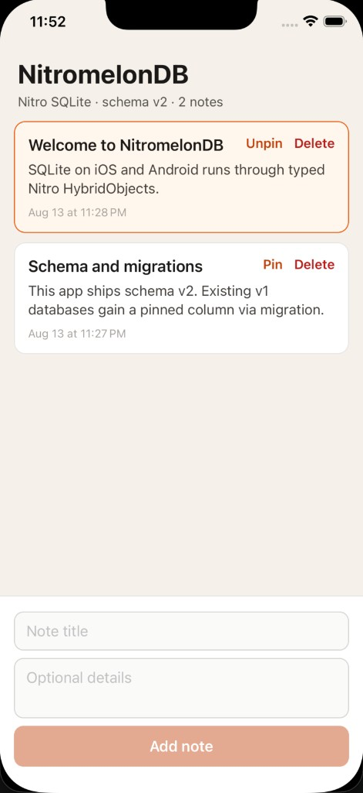

# NotesApp (iOS / Android)

Expo SDK 57 development-build app that opens SQLite through `SQLiteAdapter` → a typed `NitromelonDatabase` HybridObject. This will not run in Expo Go. New Architecture is required. `app.json` includes the `nitromelondb` config plugin (Nitro autolinking covers native SQLite; the old Android JSI Gradle module is not used).

The screen is a notes list: schema v3, v1→v2 `pinned`, v2→v3 `sort_order`, create / pin / delete, and sticky FlashList pagination (`Q.skip` + `Q.take(20)`) against the live database.

Windows lives in a sibling app, [`../NotesApp_windows`](../NotesApp_windows), because React Native Windows 0.84 tracks RN 0.84.1 while this Expo app uses RN 0.86.2. That host imports this app’s `src/` UI (with `NotesList.windows.tsx` for `FlatList`).



Before `expo run:*` or `yarn start`, check if Metro is already running on port **8081** (open terminals, `lsof -i :8081`, or `curl -s http://localhost:8081/status`). Reuse it — do not start a second dev server.

```sh
cd examples/NotesApp
yarn
npx expo prebuild
yarn expo run:ios
# or
yarn expo run:android
```

### Maestro e2e

Install the [Maestro CLI](https://docs.maestro.dev/getting-started/installing-maestro), boot a simulator, and use a development build (not Expo Go). Start Metro **without** JS dev mode, then run the suite:

```sh
cd examples/NotesApp
yarn start:e2e   # expo start --dev-client --no-dev
maestro test maestro/
# or one flow:
maestro test maestro/cold-start.yaml
```

CI runs these flows on an Android emulator (`NotesApp Android (build)` then `NotesApp Android (Maestro)`). iOS Maestro stays a local command for now. Windows uses the same scenarios via WinAppDriver in `examples/NotesApp_windows`.

| Flow | What it covers |
| --- | --- |
| `cold-start.yaml` | App launch, empty → seeded list (`100 notes`) |
| `add-pin-delete.yaml` | Create, pin, delete against live observers |
| `kill-and-relaunch.yaml` | Persistence across process kill |
| `interaction-burst.yaml` | Rapid create / pin / delete |
| `pagination-seed.yaml` | Sticky pager + `Q.skip` / `Q.take(20)` after seed |
| `pagination-dynamic.yaml` | Pager updates as notes are added/removed |

If you already have a native build and only JS changed, reload Metro. After pulling native SQLite/Nitro changes, rebuild (`yarn expo run:ios` / `yarn expo run:android`). The Expo dev menu is disabled on launch (needed for Maestro); that flag is native, so it also needs a rebuild.

The app links the library via `link:../..`. Metro watches `src/` plus WatermelonDB's JS dependencies (`rxjs`, `sql-escape-string`, …) so those imports resolve outside the example's tree.

`patches/expo-modules-jsi+57.0.4.patch` works around [expo#48522](https://github.com/expo/expo/issues/48522): on Xcode 26.3, C++ `abs` collides with Swift `abs` while compiling `ExpoModulesJSI`. Drop the patch once an `expo-modules-jsi` release includes `Swift.abs`.
