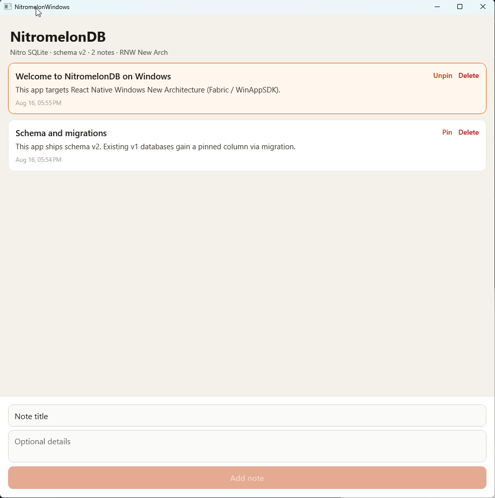

# NotesApp for Windows (New Architecture)

React Native Windows **0.84** NotesApp using the New Architecture (`cpp-app` / Fabric / WinAppSDK). This is the playground for NitromelonDB SQLite on RNW.

iOS and Android live in the sibling Expo app, [`../NotesApp`](../NotesApp). They cannot share one `package.json` yet: RNW 0.84 tracks React Native **0.84.1**, while the Expo app is on **0.86.2**.

The screen is the same notes list: schema v2, a v1→v2 `pinned` migration, plus create / pin / delete.



## Tools

| Tool | Version / notes |
| --- | --- |
| Windows | Windows 10 22H2+ or Windows 11 |
| Node.js | **22.11+** (RNW 0.84 refuses older engines) |
| Yarn | Classic (v1) — do not use npm / `package-lock.json` in this example |
| Visual Studio | **2022** (MSVC **v143**) or **2026** (MSVC **v145**) |
| Workloads | Desktop development with C++; Windows application development (Windows App SDK / WinUI) |
| Windows SDK | **10.0.26100** (pinned in `windows/ExperimentalFeatures.props`) |

If Visual Studio or the SDK is missing, run [RNW's dependency script](https://microsoft.github.io/react-native-windows/docs/rnw-dependencies) from an elevated PowerShell prompt:

```powershell
Set-ExecutionPolicy -Scope Process -ExecutionPolicy Bypass
.\node_modules\react-native-windows\scripts\rnw-dependencies.ps1
```

How Nitro is injected (TurboModule `install()` inside the NitromelonDB DLL, header shims, autolink skip): [`native/windows/README.md`](../../native/windows/README.md).

## Run

```sh
cd examples/NotesApp_windows
yarn install --ignore-scripts
yarn windows
```

`--ignore-scripts` skips the library `postinstall` (`patch-package`). That script belongs to the repo root, not this example. MSBuild still generates the Nitro `<NitroModules/…>` header map before compile.

`yarn windows` builds the WinAppSDK app and starts Metro. After JS-only changes, reload Metro. After native SQLite/Nitro changes, rebuild.

CI runs the library SQLite integration suite inside this app (`index.integration.js` + `yarn test:windows:e2e`). That uses WinAppDriver, which is already on `windows-2025` runners.

The app links the library via `file:../..`. Metro watches `src/` plus WatermelonDB JS / integration-test dependencies (`rxjs`, `sql-escape-string`, `rambdax`, `big-list-of-naughty-strings`, …) so those imports resolve outside the example tree.

## Native SQLite

This app autolinks `native/windows`, a WinAppSDK module that:

1. Implements the `NitroModules` TurboModule (`install()`) that `react-native-nitro-modules` JS expects
2. Registers the `Nitromelon` HybridObject and runs SQLite through the same C++ engine as iOS/Android

`react-native-nitro-modules` still has no official Windows autolink ([nitro#168](https://github.com/mrousavy/nitro/issues/168)), so `react-native.config.js` spreads `windowsAppDependencies()` from `windows-autolink.js`. That skips Nitro's missing Windows project; NitromelonDB's DLL is the install entry point.

## Regenerating the Windows project

```sh
yarn react-native init-windows --template cpp-app --name NitromelonWindows --namespace NitromelonWindows --overwrite
```

Re-apply Metro / `react-native.config.js` customizations afterward — `init-windows` overwrites `metro.config.js`.
